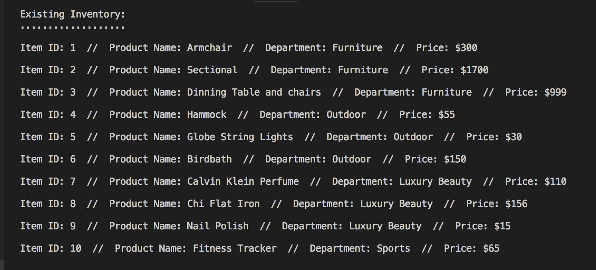
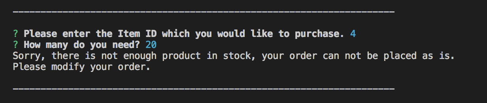
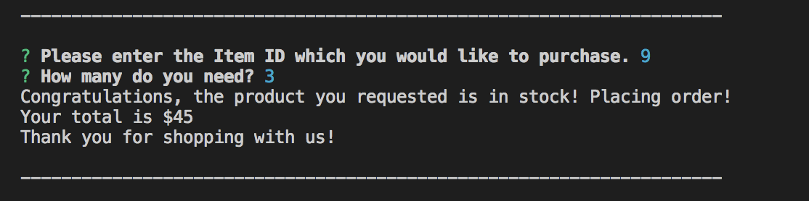

# Bamazon-app
Node.js &amp; MySQL app

* The app first displays all products, their price and ID to screen and then waits for user to enter ID of the product they wish to purchase.

* Then when user selects product they wish to purchase the app asks for the quantity they want to purchase. After user enters quantity the app checks with the database to ensure there is enough quantity available in stock to satisfy order. If not then it displays the message.

* If there is enough quantity in stock to satisfy order then app displays the summary of the purchase.

## Technologies used

- Node.js
- MySQL
- MySQL NPM Package
- Javascript
- Inquirer NPM Package

